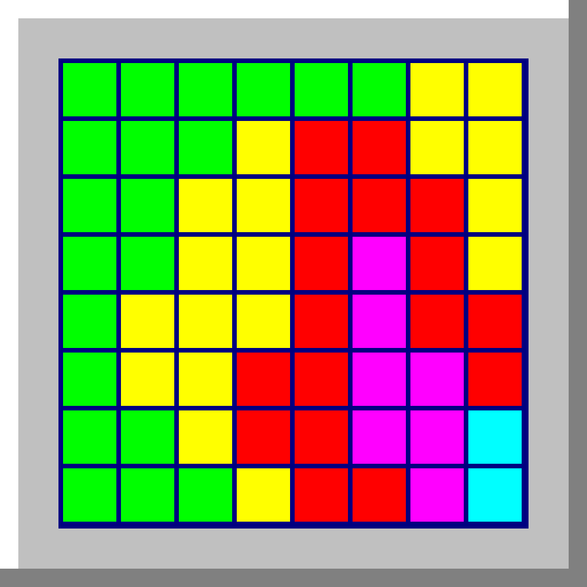

# DEFRAG.EXE

A Win9x-styled defrag-themed clicker / idler.

You are a sysadmin in 1995. The drive needs defragmenting. So does the next one. So do all twenty-four after that. Buy upgrades, automate the boring parts, prestige when the disks get cruel, and watch the little coloured blocks march into place.



---

## Download & play

Grab the latest build for your OS from the [Releases page](../../releases) — no Python install needed.

| OS | File | How to launch |
|---|---|---|
| **Windows (x64)** | `defrag-windows-x64.zip` | Unzip, double-click `DEFRAG.EXE.exe`. |
| **macOS (Universal — Intel + Apple Silicon)** | `defrag-macos.zip` | Unzip, double-click `DEFRAG.app`. |
| **Linux (x64)** | `defrag-linux-x64.tar.gz` | Extract, `chmod +x defrag-linux-x64`, then run. SDL2 must be installed (`libsdl2-2.0-0`, `libsdl2-ttf-2.0-0` on Debian/Ubuntu). |

### First-launch warnings

The binaries are **unsigned**. Your OS will complain on first launch.

- **Windows SmartScreen:** "Windows protected your PC" → click **More info** → **Run anyway**.
- **macOS Gatekeeper:** "DEFRAG.app can't be opened because it is from an unidentified developer." Right-click the app → **Open** → **Open** in the dialog. Or, in Terminal: `xattr -d com.apple.quarantine /path/to/DEFRAG.app`.

This is normal for hobby releases. Signing requires a paid certificate (Windows) or Apple Developer enrollment (macOS).

### Save files

The game persists three save slots and autosaves periodically to:

| OS | Location |
|---|---|
| Windows | `%APPDATA%\defrag.exe\saves\` |
| macOS | `~/Library/Application Support/defrag.exe/saves/` |
| Linux | `$XDG_DATA_HOME/defrag.exe/saves/` (defaults to `~/.local/share/defrag.exe/saves/`) |

Saves are plain JSON. Back them up before raging.

---

## Gameplay

- **Click the grid** to defragment files. Each click moves clusters.
- **Buy skill nodes** with Defrag Points (DP) to make clicks fatter, install auto-defraggers, and learn filesystem tricks.
- **Clear the drive** before the timer runs out to unlock the next disk.
- **Prestige** when a drive defeats you — keep a sliver of progress (Legacy Points) in exchange for resetting. Some skills are gated until you've prestiged a few times.
- Drives go C: through Z:. Boss drives (H, N, R, V, Z) have hardness spikes.
- A maxed prestige tree clears Z: with seconds to spare. That is the win condition.

The game is built around **clean math**: every node is a `+%` or `×` on one of a handful of stats. No special cooldowns, no abilities, no surprises — just numbers getting bigger and disks getting meaner. Run `python tools/balance_sim.py` to simulate runs offline.

---

## Building from source

See [PROTOTYPE_README.md](PROTOTYPE_README.md) for the development setup, or look at [defrag.spec](defrag.spec) and [.github/workflows/release.yml](.github/workflows/release.yml) for the build pipeline.

Quick start (Linux/macOS with Python 3.11+ and SDL2 installed):

```bash
pip install pygame
python src/main.py
```

To build a binary for your current OS:

```bash
pip install pyinstaller
pyinstaller defrag.spec --clean --noconfirm
# Output in dist/
```

---

## Status

This is a **prototype**. The systems are all working, the math is balanced, but the polish is not what it would be in a v1.0 — no sound, no in-game help beyond the legend dialog, no animations beyond the grid. If you enjoy it anyway, that's lovely.

## Credits

Created by Jim. Built with [pygame](https://www.pygame.org/). Inspired by the Microsoft (sorry, **M1CROSOFT**) defrag screen that an entire generation watched motionlessly for hours.
